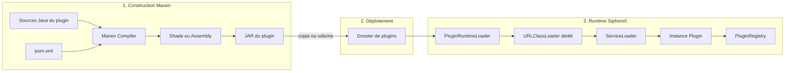
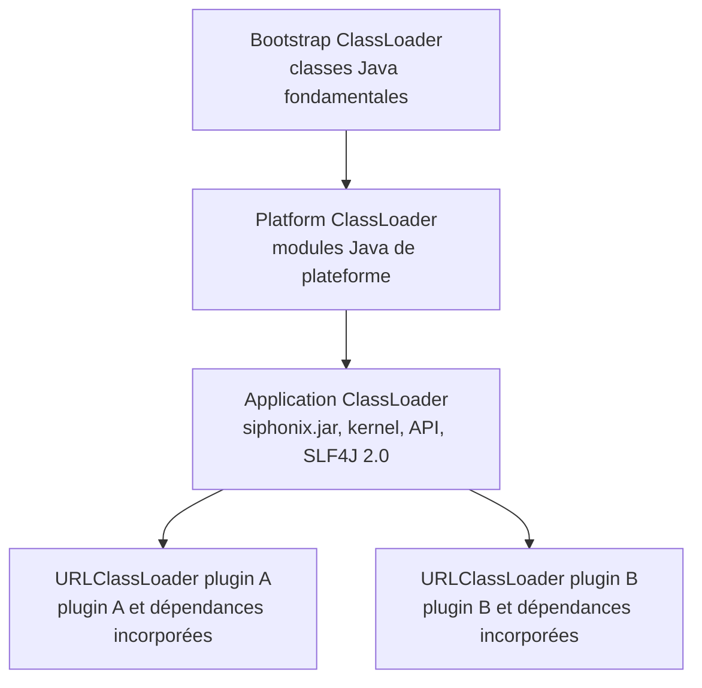
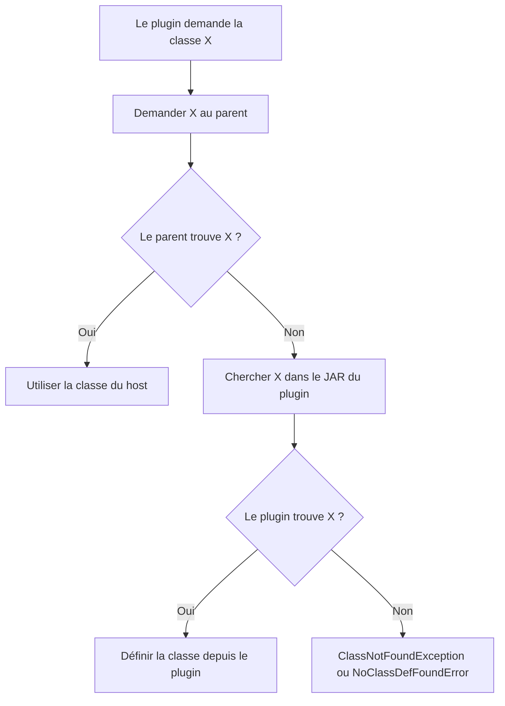
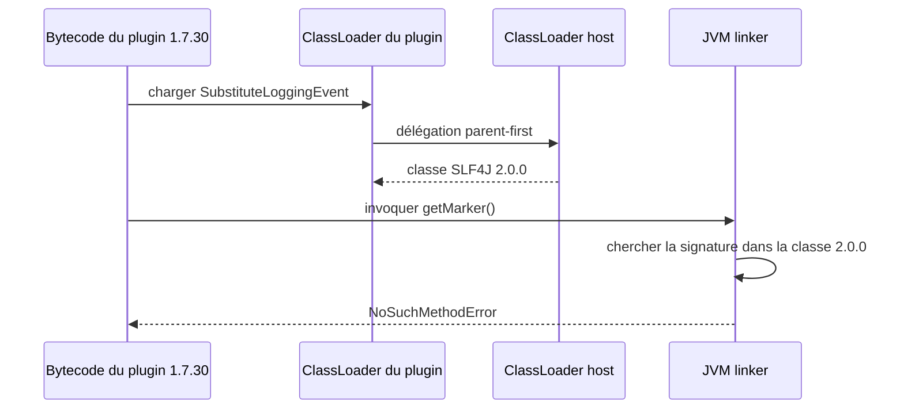
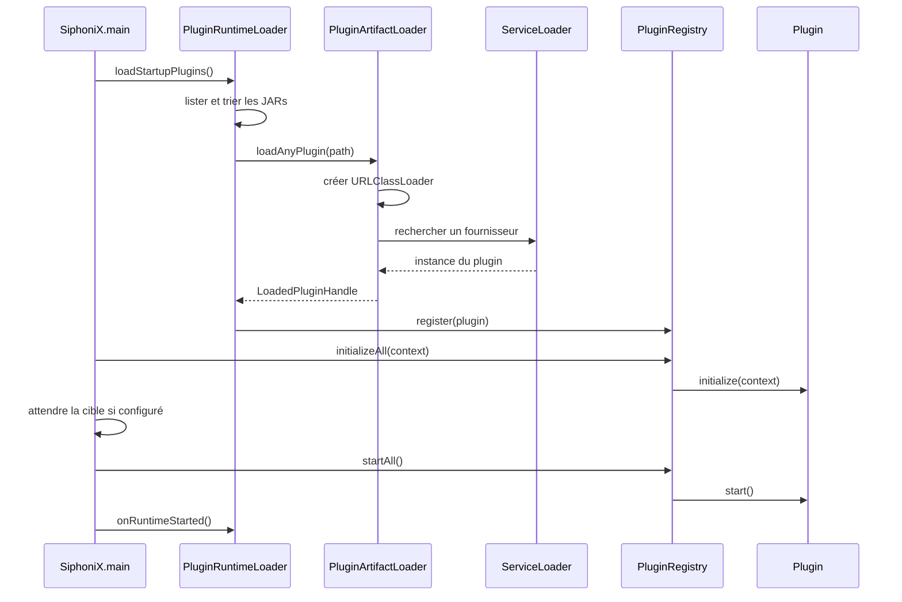
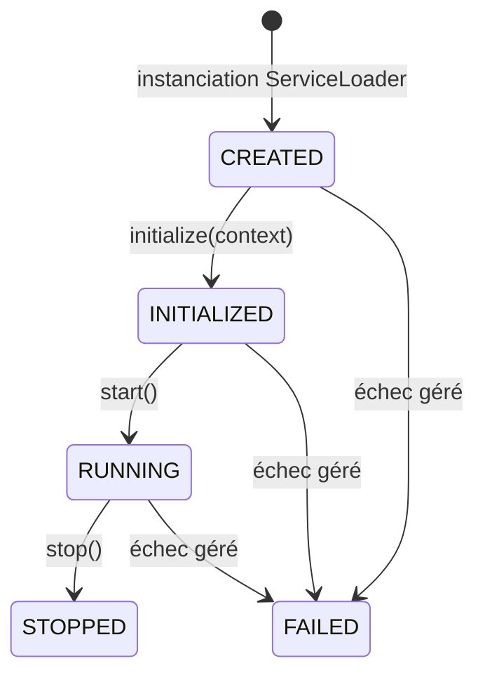

# Modèle du processus de chargement d'un plugin SiphoniX

## 1. Objectif du document

Ce document décrit le chemin complet d'un plugin, depuis son code source jusqu'à son exécution dans
SiphoniX. Il répond notamment aux questions suivantes :

- Maven compile-t-il le plugin séparément du runtime ?
- quelles dépendances sont placées dans chaque JAR ?
- SiphoniX copie-t-il ou compile-t-il un plugin au démarrage ?
- comment `ServiceLoader` trouve-t-il la classe principale du plugin ?
- comment la JVM choisit-elle entre une classe du runtime et une classe du plugin ?
- quelle isolation apporte un `URLClassLoader` dédié ?
- que se passe-t-il en cas de dépendance absente ou incompatible ?
- comment fonctionnent l'initialisation, le démarrage, le rechargement et l'arrêt ?

La distinction la plus importante est la suivante :

> Maven résout les dépendances et produit les JARs pendant la construction. Au runtime, SiphoniX
> ne relance pas Maven, ne compile aucun fichier Java et ne télécharge aucune dépendance. Il donne
> simplement un JAR déjà construit à un classloader Java.

## 2. Vue générale

Le système possède trois phases distinctes :

1. **construction** : Maven compile les modules et fabrique les archives ;
2. **déploiement** : les JARs de plugins sont déposés dans le dossier configuré ;
3. **chargement runtime** : SiphoniX découvre, charge, instancie, initialise et démarre les plugins.



## 3. Construction Maven

### 3.1 Reactor Maven et dépendances Maven

Le `pom.xml` racine déclare les modules suivants :

```text
siphonix-api
siphonix-kernel
siphonix-runtime
siphonix-plugins
```

Le module `siphonix-plugins` est lui-même un agrégateur de type `pom` qui déclenche la construction
des plugins. Une déclaration `<module>` signifie seulement « construire ce projet dans le même
reactor ». Elle ne signifie pas « incorporer ce module dans tous les autres JARs ».

Un module est incorporé dans un autre uniquement lorsqu'il apparaît dans sa section
`<dependencies>` et que son scope autorise son inclusion.

La commande de la démonstration est :

```bash
mvn -q \
  -pl siphonix-runtime,siphonix-plugins/dependency-conflict-demo-plugin,siphonix-plugins/security-demo-plugin \
  -am package
```

- `-pl` sélectionne les projets à construire ;
- `-am` construit également leurs dépendances de reactor ;
- `package` compile, teste et produit les JARs.

Cette commande construit plusieurs artefacts séparés. Elle ne fusionne pas automatiquement les
plugins avec le runtime.

### 3.2 Résolution Maven pendant la compilation

Maven lit chaque `pom.xml`, choisit une version pour chaque coordonnée
`groupId:artifactId`, puis construit le classpath du compilateur Java.

Les dépendances peuvent venir :

- d'un autre module du reactor courant ;
- du dépôt Maven local, généralement `~/.m2/repository` ;
- d'un dépôt distant si l'artefact n'est pas encore présent localement.

Le compilateur transforme ensuite les fichiers `.java` en `.class`. Le bytecode conserve des
références symboliques telles que :

```text
org/slf4j/event/SubstituteLoggingEvent.getMarker:()Lorg/slf4j/Marker;
```

Il ne conserve pas l'information « utiliser obligatoirement le JAR Maven 1.7.30 ». Cette référence
sera résolue plus tard par la JVM à partir des classes réellement visibles au runtime.

### 3.3 Effet des scopes Maven

| Scope | Compilation | Tests | Candidat à l'empaquetage fat JAR | Disponible automatiquement au runtime |
|---|---|---|---|---|
| `compile` | Oui | Oui | Oui | Seulement si incorporé ou fourni au classpath |
| `provided` | Oui | Oui | Non | Doit être fourni par SiphoniX ou l'environnement |
| `runtime` | Non pour compiler le code | Oui | Oui | Seulement si incorporé ou fourni au classpath |
| `test` | Tests seulement | Oui | Non | Non |

Pour un contrat partagé comme `siphonix-api`, le modèle recommandé pour un plugin externe est
`provided` : le plugin compile contre l'API, mais utilise au runtime la copie appartenant au host.
Cela évite d'avoir deux définitions concurrentes de l'interface `Plugin`.

### 3.4 Les trois formes de packaging présentes dans le projet

#### Runtime SiphoniX

Le module `siphonix-runtime` utilise `maven-assembly-plugin` avec
`jar-with-dependencies`. Son archive exécutable contient :

```text
siphonix.jar
├── SiphoniX
├── siphonix-kernel
├── siphonix-api
├── slf4j-api 2.0.0
└── slf4j-simple 2.0.0
```

Il ne contient pas les plugins, car ceux-ci ne sont pas déclarés comme dépendances du module
runtime.

#### Plugin de conflit

`dependency-conflict-demo-plugin` utilise `maven-shade-plugin` :

```text
dependency-conflict-demo-plugin-1.0.0.jar
├── DependencyConflictDemoPlugin.class
├── META-INF/services/...Plugin
├── classes de slf4j-api 1.7.30
└── métadonnées Maven de slf4j-api 1.7.30
```

`siphonix-api` a le scope `provided`, donc sa copie n'est pas incorporée. SLF4J 1.7.30 a le scope
normal `compile`, donc le plugin Shade décompresse ses classes et les fusionne dans le JAR final.
Il ne s'agit pas d'un JAR SLF4J imbriqué : les classes `org/slf4j/...` sont directement présentes
dans l'archive du plugin.

#### Plugin de sécurité

`security-demo-plugin` produit un JAR standard, sans assembly ni shade. Il ne contient que les
classes et ressources du plugin. Son utilisation de `siphonix-api` fonctionne parce que le parent
classloader de SiphoniX fournit cette API.

#### Plugin AdaptiFlow

`adaptiflow-engine-plugin` produit aussi un `jar-with-dependencies`. Ses dépendances applicatives
sont donc fusionnées dans une seconde archive destinée au dossier de plugins.

### 3.5 Thin JAR et fat JAR

| Type d'archive | Contenu | Conséquence dans l'architecture actuelle |
|---|---|---|
| Thin JAR | classes du plugin uniquement | les autres bibliothèques doivent être fournies par le host |
| Fat JAR / shaded JAR | plugin et dépendances privées fusionnés | autonome, mais risque de collision avec les classes du host |
| Plusieurs JARs côte à côte | plugin et bibliothèques séparés | non pris en charge explicitement par le chargeur actuel |

Le `PluginArtifactLoader` construit son classloader avec une seule URL : celle du JAR du plugin.
Il n'ajoute pas automatiquement tous les JARs voisins à ce classloader. Dans le modèle courant,
une dépendance privée doit donc généralement être incorporée dans le JAR du plugin.

## 4. Déploiement dans la démonstration Docker

### 4.1 Copie effectuée par `run.sh`

Après la construction, `run.sh` prépare cette arborescence :

```text
samples/siphonix-plugin-risk-demo/
├── siphonix-app.jar
└── plugins/
    ├── dependency-conflict-demo-plugin-1.0.0.jar
    └── security-demo-plugin-1.0.0.jar
```

Le script utilise de simples commandes `cp`. Il ne recompile pas les JARs pendant cette copie.

### 4.2 Image et volumes Docker

Le `Dockerfile` ne copie que le runtime :

```dockerfile
COPY siphonix-app.jar /opt/siphonix/siphonix.jar
```

Les plugins sont rendus disponibles par un volume Compose :

```yaml
volumes:
  - ./plugins:/opt/siphonix/plugins:ro
```

Ils ne sont donc ni fusionnés dans `siphonix.jar`, ni nécessairement enregistrés dans une couche de
l'image. Ils apparaissent dans le système de fichiers du conteneur au moment où le volume est monté.

```mermaid
flowchart TB
    subgraph Host[Machine hôte]
        RuntimeFile[siphonix-app.jar]
        PluginDir[plugins/]
        ConflictJar[dependency-conflict-demo-plugin.jar]
        SecurityJar[security-demo-plugin.jar]
        PluginDir --> ConflictJar
        PluginDir --> SecurityJar
    end

    subgraph Image[Image SiphoniX]
        RuntimeJar[/opt/siphonix/siphonix.jar]
    end

    subgraph Container[Conteneur en exécution]
        MountedDir[/opt/siphonix/plugins]
    end

    RuntimeFile -->|Docker COPY| RuntimeJar
    PluginDir -->|bind mount read-only| MountedDir
```

## 5. Découverte des plugins au runtime

### 5.1 Choix du dossier

Le dossier est sélectionné selon cette priorité :

1. option CLI `--plugin-dir` ;
2. variable `SIPHONIX_PLUGIN_DIR` ;
3. valeur par défaut `/opt/siphonix/plugins`.

### 5.2 Inventaire des archives

`PluginRuntimeLoader.listJarFiles()` :

1. vérifie que le dossier existe ;
2. ne retient que les fichiers réguliers terminant par `.jar` ;
3. trie les chemins pour obtenir un ordre stable ;
4. transmet chaque archive modifiée à `loadAndActivate()`.

SiphoniX ne lit pas le `pom.xml` du plugin pour résoudre ses dépendances et n'exécute pas
`mvn dependency:resolve`. Le JAR doit déjà être exécutable avec les classes du host et celles qu'il
contient.

### 5.3 Modes de découverte

| Mode | Démarrage | Changements ultérieurs |
|---|---|---|
| `startup-only` | charge les JARs présents | aucun watcher |
| `watch-auto` | charge les JARs présents | détecte et applique automatiquement ajout, modification ou suppression |
| `watch-manual` | charge les JARs présents | place les changements en attente d'une action explicite |

Le watcher, lorsqu'il est actif, exécute un scan toutes les deux secondes. Une modification est
détectée par la date `lastModified` du fichier.

## 6. Création du classloader du plugin

Pour chaque artefact, `PluginArtifactLoader` crée :

```java
new URLClassLoader(
    new URL[] { artifactPath.toUri().toURL() },
    getClass().getClassLoader()
);
```

Les deux paramètres sont essentiels :

- l'unique URL propre au classloader est le JAR du plugin ;
- le parent est le classloader qui a chargé le noyau SiphoniX.

Chaque plugin obtient une instance distincte de `URLClassLoader`.



Les deux classloaders de plugins sont frères : le plugin A ne recherche normalement pas ses classes
dans le JAR du plugin B. Ils partagent cependant toutes les classes du parent.

## 7. Découverte de l'implémentation avec ServiceLoader

Un JAR n'est pas reconnu comme plugin uniquement parce qu'il contient une classe qui implémente
`Plugin`. Il doit aussi déclarer un fournisseur dans `META-INF/services`.

Pour le plugin de conflit, le fichier est :

```text
META-INF/services/tools.spirals.cerberus237.siphonix.api.plugin.Plugin
```

Son contenu est le nom pleinement qualifié de l'implémentation :

```text
tools.spirals.cerberus237.siphonix.demo.conflict.DependencyConflictDemoPlugin
```

Le chargeur essaie les contrats dans cet ordre :

1. `ScenarioManagementPlugin` ;
2. `Plugin`.

Pour chaque contrat, il appelle :

```java
ServiceLoader.load(pluginType, pluginClassLoader)
```

`ServiceLoader` lit le descripteur, charge la classe indiquée, vérifie qu'elle est compatible avec le
contrat demandé et l'instancie avec son constructeur accessible sans argument.

Si aucun fournisseur compatible n'est trouvé, le classloader créé pour cette tentative est fermé.

## 8. Résolution des classes et des dépendances

### 8.1 Maven et la JVM ne font pas le même travail

| Moment | Responsable | Travail effectué |
|---|---|---|
| Build | Maven | sélectionne des versions, télécharge des artefacts, construit les classpaths |
| Compilation | `javac` | vérifie les appels contre les API sélectionnées et produit le bytecode |
| Packaging | Shade/Assembly/JAR | place les classes et ressources dans les archives finales |
| Runtime | Classloaders de la JVM | cherche une classe par son nom binaire |
| Linking | JVM | résout les champs, méthodes et interfaces référencés par le bytecode |

La JVM ne comprend pas les coordonnées Maven. Pour elle, les identités pertinentes sont notamment :

```text
nom complet de la classe + classloader qui l'a définie
```

Deux classes portant le même nom mais définies par deux classloaders différents sont deux types Java
différents.

### 8.2 Algorithme parent-first

`URLClassLoader` utilise par défaut la délégation parent-first.



Conséquences :

| Présence de la classe | Classe utilisée |
|---|---|
| seulement dans le host | host |
| seulement dans le plugin | plugin |
| dans le host et le plugin | host |
| absente des deux | échec de chargement |

Le simple fait qu'une classe se trouve physiquement dans le JAR du plugin ne garantit donc pas
qu'elle sera utilisée.

### 8.3 Résolution paresseuse

Le chargement du JAR et même l'instanciation du plugin peuvent réussir alors qu'une dépendance est
incompatible. Beaucoup de références symboliques ne sont résolues qu'au premier appel réel.

Cela explique qu'un plugin puisse :

1. être découvert par `ServiceLoader` ;
2. être enregistré ;
3. être initialisé ;
4. échouer seulement lorsqu'une méthode particulière est exécutée dans `start()`.

## 9. Exemple complet du conflit SLF4J

### 9.1 À la compilation

Le plugin est compilé avec :

```text
org.slf4j:slf4j-api:1.7.30
```

Dans cette version, la méthode suivante existe :

```java
SubstituteLoggingEvent.getMarker()
```

Le compilateur accepte donc l'appel et écrit cette signature dans le bytecode du plugin.

### 9.2 Au runtime

Le host contient :

```text
org.slf4j:slf4j-api:2.0.0
```

Le plugin contient également les classes 1.7.30, mais la classe
`org.slf4j.event.SubstituteLoggingEvent` existe déjà dans le parent. Le classloader choisit donc la
version 2.0.0.

Dans cette version, `getMarker()` n'existe plus ; l'API expose notamment `getMarkers()` et
`addMarker(...)`.



L'erreur observée est :

```text
java.lang.NoSuchMethodError:
'org.slf4j.Marker org.slf4j.event.SubstituteLoggingEvent.getMarker()'
```

Ce n'est pas une erreur de compilation. C'est une incompatibilité binaire découverte pendant le
linking runtime.

## 10. Enregistrement et cycle de vie

### 10.1 Démarrage initial

Le démarrage normal suit cet ordre :



Les indicateurs `runtimeInitialized` et `runtimeStarted` servent aux plugins ajoutés plus tard :

- après l'initialisation du runtime, un nouveau plugin est immédiatement initialisé ;
- après le démarrage du runtime, un nouveau plugin est immédiatement initialisé puis démarré.

### 10.2 États attendus du plugin



Le plugin est responsable de la mise à jour de son propre `PluginState`. Le registre appelle les
méthodes de cycle de vie mais ne vérifie pas systématiquement que `start()` a effectivement placé le
plugin dans l'état `RUNNING`.

### 10.3 Mode commande

Lorsque des tokens comme `plugin list` sont présents, SiphoniX utilise un runtime transitoire :

1. chargement ;
2. initialisation ;
3. démarrage ;
4. exécution de la commande ;
5. fermeture des classloaders et arrêt des plugins ;
6. fin du processus Java.

C'est pour cette raison que le conteneur de démonstration sort normalement avec le code `0` après
`plugin list`.

## 11. Rechargement et déchargement

Pour chaque plugin actif, `PluginRuntimeLoader` conserve un `LoadedPluginHandle` contenant :

- l'instance du plugin ;
- son classloader ;
- le chemin de son artefact ;
- le contrat utilisé pour le charger.

Lors d'un déchargement :

1. le registre arrête le plugin s'il est `RUNNING` ;
2. l'instance est retirée du registre ;
3. les associations artefact/plugin sont supprimées ;
4. `URLClassLoader.close()` est appelé.

Fermer le classloader libère ses ressources de lecture du JAR, mais ne garantit pas le déchargement
immédiat des classes. Elles ne pourront être collectées que si aucune référence restante ne retient
l'instance, le classloader, une classe, un thread, un `ThreadLocal` ou un callback du plugin.

Lors d'un remplacement, l'ancien plugin est arrêté, la nouvelle instance est enregistrée et
initialisée, puis redémarrée si l'ancienne instance était en cours d'exécution.

## 12. Ce que le classloader isole et ce qu'il n'isole pas

### 12.1 Isolation fournie

- un classloader distinct est créé pour chaque artefact ;
- les classes privées absentes du host peuvent avoir des versions différentes dans deux plugins ;
- le classloader peut être fermé lors du déchargement ;
- un plugin ne reçoit pas automatiquement les URLs privées de son voisin.

### 12.2 Isolation non fournie

Tous les plugins s'exécutent dans la même JVM et le même processus que SiphoniX. Ils partagent :

- les droits système et l'utilisateur du processus ;
- la mémoire et le tas JVM ;
- les propriétés système ;
- les variables d'environnement ;
- le système de fichiers accessible ;
- le réseau accessible ;
- les classes du parent ;
- les bibliothèques natives chargées dans le processus.

Un classloader n'est donc pas une sandbox de sécurité.

## 13. Principales erreurs possibles

| Erreur | Cause typique |
|---|---|
| `ClassNotFoundException` | classe demandée explicitement mais absente du parent et du JAR du plugin |
| `NoClassDefFoundError` | classe nécessaire au bytecode absente au moment de son utilisation |
| `NoSuchMethodError` | classe trouvée, mais version runtime dépourvue de la méthode compilée |
| `NoSuchFieldError` | champ présent à la compilation mais absent au runtime |
| `AbstractMethodError` | implémentation incompatible avec une interface chargée au runtime |
| `ClassCastException` | types homonymes définis par des classloaders différents |
| `ServiceConfigurationError` | fournisseur absent, invalide ou impossible à instancier |
| `LinkageError` | famille générale d'incompatibilités binaires JVM |

Certaines erreurs de linkage héritent de `Error`, pas de `RuntimeException`. Le code du plugin de
conflit capture volontairement son `NoSuchMethodError`; sans cette capture, il pourrait sortir des
blocs qui ne traitent que les exceptions ordinaires et interrompre le démarrage global.

## 14. Limites actuelles du modèle

1. Le chargeur ne résout pas un graphe Maven au runtime.
2. Il n'ajoute explicitement qu'un JAR par classloader de plugin.
3. Il ne possède pas de stratégie child-first configurable.
4. Il ne vérifie pas à l'avance la compatibilité binaire host/plugin.
5. Il ne garantit pas le déchargement mémoire si le plugin conserve des références actives.
6. Il ne fournit aucune isolation de permissions ou de processus.
7. Les conflits avec une classe du parent sont gagnés par le parent, même si le plugin incorpore
   une autre version.
8. Le registre s'appuie sur l'implémentation du plugin pour maintenir correctement son état.

## 15. Checklist de création d'un plugin chargeable

1. Dépendre de la version compatible de `siphonix-api`.
2. Implémenter `Plugin` ou un contrat spécialisé supporté.
3. Fournir un constructeur accessible sans argument.
4. Implémenter correctement `getId()`, `getVersion()` et `getState()`.
5. Respecter le cycle `initialize()` → `start()` → `stop()`.
6. Créer le fichier `META-INF/services/<nom-du-contrat>`.
7. Placer le nom pleinement qualifié de l'implémentation dans ce fichier.
8. Marquer l'API du host `provided` lorsque le packaging utilisé incorporerait autrement les
   dépendances.
9. Incorporer les dépendances réellement privées dans un fat JAR, ou adopter un packaging pris en
   charge explicitement par le chargeur.
10. Tester le plugin avec les versions exactes des dépendances du runtime, pas uniquement avec son
    classpath Maven isolé.
11. Vérifier le contenu final avec `jar tf`.
12. Déposer le JAR dans le dossier configuré.

## 16. Commandes de diagnostic utiles

Afficher le contenu du runtime :

```bash
jar tf siphonix-runtime/target/io.github.brice10.siphonix-jar-with-dependencies.jar
```

Rechercher une classe dans le runtime :

```bash
jar tf siphonix-runtime/target/io.github.brice10.siphonix-jar-with-dependencies.jar \
  | grep DependencyConflictDemoPlugin
```

Rechercher la même classe dans le plugin :

```bash
jar tf siphonix-plugins/dependency-conflict-demo-plugin/target/dependency-conflict-demo-plugin-1.0.0.jar \
  | grep DependencyConflictDemoPlugin
```

Afficher le descripteur ServiceLoader :

```bash
unzip -p \
  siphonix-plugins/dependency-conflict-demo-plugin/target/dependency-conflict-demo-plugin-1.0.0.jar \
  META-INF/services/tools.spirals.cerberus237.siphonix.api.plugin.Plugin
```

Inspecter la signature appelée par le bytecode :

```bash
javap -classpath \
  siphonix-plugins/dependency-conflict-demo-plugin/target/dependency-conflict-demo-plugin-1.0.0.jar \
  -c tools.spirals.cerberus237.siphonix.demo.conflict.DependencyConflictDemoPlugin
```

## 17. Modèle mental final

```text
Maven choisit et compile les dépendances
                   |
                   v
          JARs finaux indépendants
                   |
          copie ou montage du plugin
                   |
                   v
      PluginRuntimeLoader découvre le JAR
                   |
                   v
      URLClassLoader dédié, parent = host
                   |
                   v
     ServiceLoader instancie le fournisseur
                   |
                   v
       PluginRegistry gère le cycle de vie
                   |
                   v
  La JVM résout les classes en parent-first
                   |
          +--------+--------+
          |                 |
          v                 v
 classe du host       classe du plugin
 si elle existe       sinon, si présente
```

Le point central à retenir est que le plugin possède un espace de chargement distinct, mais pas un
environnement d'exécution distinct. Ses classes privées peuvent être isolées, tandis que toutes les
classes déjà disponibles dans SiphoniX sont prioritaires et que tous les plugins conservent les
permissions du même processus.
