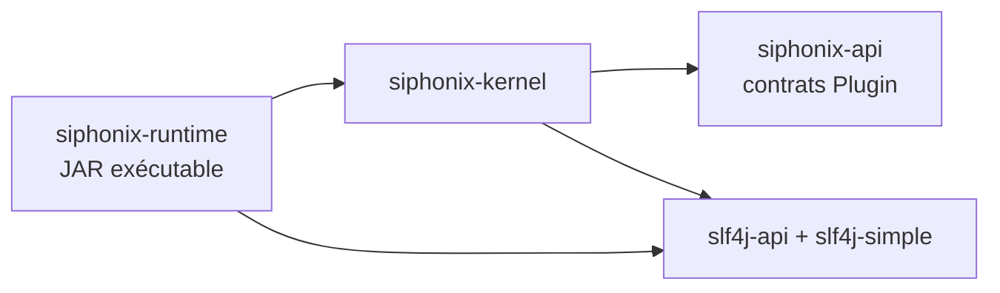
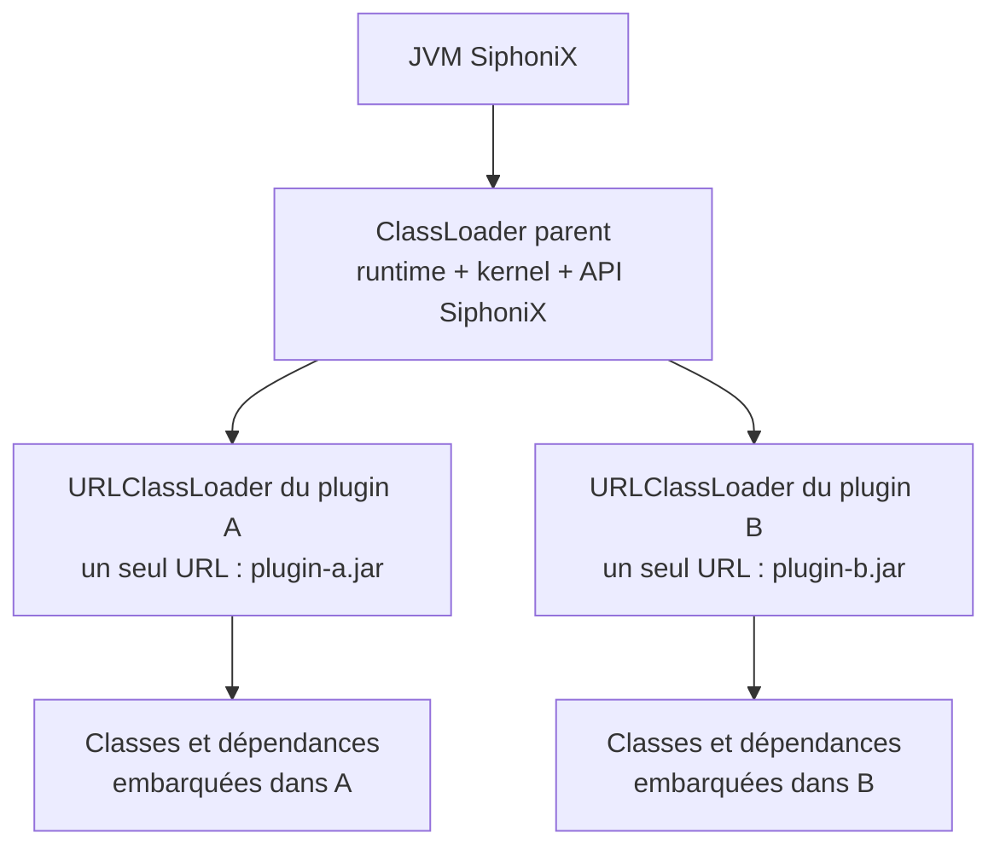
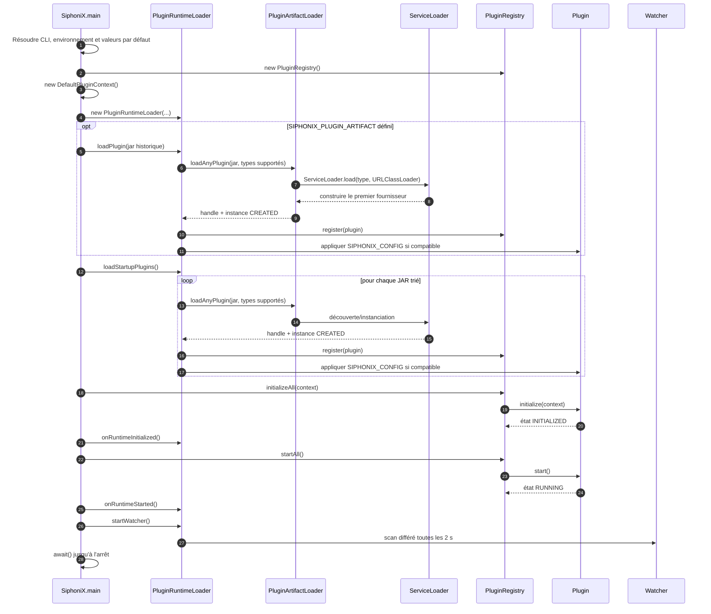
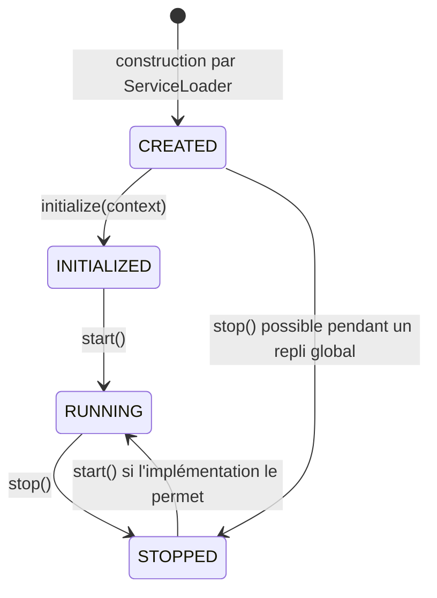
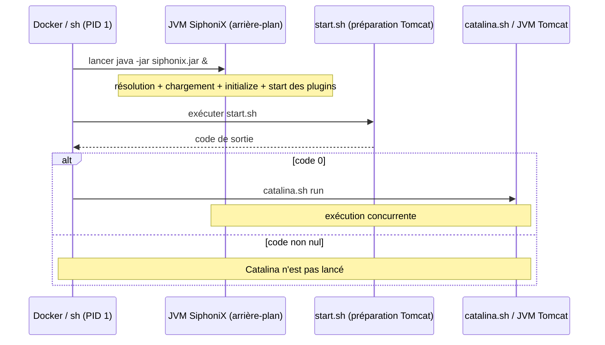

# Rapport d’analyse — Chargement d’un plugin dans SiphoniX

**Périmètre :** état du dépôt analysé le 8 septembre 2026  
**Objet :** modéliser précisément la découverte, le chargement, l’initialisation et le démarrage d’un plugin, puis situer ces opérations par rapport au démarrage de Tomcat/Catalina.

## 1. Synthèse

SiphoniX charge ses plugins dans **sa propre JVM**, distincte de la JVM Tomcat. Un plugin est un JAR découvert dans un répertoire, ouvert avec un `URLClassLoader` dédié, puis instancié par le mécanisme Java `ServiceLoader`. L’instance est enregistrée dans `PluginRegistry`, reçoit un `PluginContext`, passe de `CREATED` à `INITIALIZED`, puis est démarrée et passe à `RUNNING`.

Au démarrage normal, la séquence interne est la suivante :

1. résolution de la configuration ;
2. création du registre, du contexte et du chargeur de plugins ;
3. chargement éventuel de l’artefact historique indiqué par `SIPHONIX_PLUGIN_ARTIFACT` ;
4. scan trié des JAR du répertoire de plugins ;
5. instanciation et enregistrement des plugins ;
6. application éventuelle du scénario `SIPHONIX_CONFIG` ;
7. initialisation de tous les plugins ;
8. démarrage de tous les plugins ;
9. démarrage du watcher, si le mode de découverte l’autorise ;
10. attente jusqu’à l’arrêt de la JVM.

Dans les images d’exemple, le shell lance d’abord la commande SiphoniX **en arrière-plan**, exécute ensuite `start.sh`, puis exécute `catalina.sh run` au premier plan. Cela fixe l’ordre de **lancement des commandes**, mais ne garantit pas que SiphoniX ou ses plugins soient prêts avant Catalina : SiphoniX et la préparation/démarrage de Tomcat s’exécutent en pratique de manière concurrente.

Enfin, Tomcat et Catalina ne sont pas deux serveurs successifs. **Catalina est le conteneur de servlets au cœur de Tomcat** ; dans ce projet, `catalina.sh run` est la commande qui démarre réellement Tomcat au premier plan. Le `start.sh` placé dans `/usr/local/tomcat/bin` est un script de préparation de la configuration fourni par l’image de base, et non le `startup.sh` standard de Tomcat.

## 2. Composants impliqués

| Composant | Rôle dans le chargement | Source principale |
|---|---|---|
| `SiphoniX` | Point d’entrée, configuration et orchestration globale | `siphonix-runtime/.../SiphoniX.java:49` |
| `PluginRuntimeLoader` | Découverte des JAR, activation, remplacement, retrait et surveillance | `siphonix-kernel/.../loading/PluginRuntimeLoader.java:48` |
| `PluginArtifactLoader` | Création du classloader et instanciation par `ServiceLoader` | `siphonix-kernel/.../loading/PluginArtifactLoader.java:44` |
| `PluginRegistry` | Enregistrement et propagation de `initialize`, `start` et `stop` | `siphonix-kernel/.../PluginRegistry.java:40` |
| `Plugin` | Contrat minimal et cycle de vie commun | `siphonix-api/.../plugin/Plugin.java:23` |
| `PluginContext` / `DefaultPluginContext` | Données fournies par l’hôte au plugin, actuellement l’URL de la cible | `siphonix-kernel/.../DefaultPluginContext.java:32` |
| `AdaptiflowEngineManagementPlugin` | Plugin officiel de gestion des scénarios | `siphonix-plugins/adaptiflow-engine-plugin/.../AdaptiflowEngineManagementPlugin.java:40` |
| `ScenarioPlugin` | Sous-runtime créé pour chaque scénario AdaptiFlow actif | `siphonix-plugins/adaptiflow-engine-plugin/.../ScenarioPlugin.java:18` |

Les chemins abrégés ci-dessus sont détaillés dans la section « Sources vérifiées ».

## 3. Contrat et dépendances d’un plugin

### 3.1 Contrat Java obligatoire

Un fournisseur chargeable doit implémenter au minimum `Plugin`, qui expose :

- `getId()` : identifiant stable et globalement unique ;
- `getVersion()` : version déclarée par le plugin ;
- `getState()` : état courant ;
- `initialize(PluginContext)` : injection du contexte et préparation des ressources ;
- `start()` : activation du traitement ;
- `stop()` : arrêt et libération des ressources.

Le runtime essaie les contrats dans cet ordre :

1. `ScenarioManagementPlugin` ;
2. `Plugin` générique.

Cette priorité est codée dans `PluginRuntimeLoader.java:52-54`. Le premier fournisseur découvert pour le premier contrat compatible est retenu. Un même JAR n’est donc pas conçu ici pour exposer et activer plusieurs instances de plugins indépendantes : `PluginArtifactLoader` retourne dès le premier fournisseur (`PluginArtifactLoader.java:49-52`).

### 3.2 Descripteur `ServiceLoader`

Le JAR doit contenir un fichier :

```text
META-INF/services/<nom pleinement qualifié du contrat>
```

Son contenu indique la classe d’implémentation. Pour le plugin officiel :

```text
META-INF/services/tools.spirals.cerberus237.siphonix.api.plugin.management.ScenarioManagementPlugin
```

contient :

```text
tools.spirals.cerberus237.adaptiflow.plugin.runtime.AdaptiflowEngineManagementPlugin
```

Sur le classpath Java utilisé ici, le fournisseur doit être instanciable par `ServiceLoader`, donc être une classe fournisseur accessible avec un constructeur sans argument utilisable. Le constructeur est exécuté pendant l’itération `for (T plugin : loader)` : c’est à ce moment que l’instance initiale, normalement dans l’état `CREATED`, apparaît.

### 3.3 Dépendances de l’hôte

Le graphe des modules de l’hôte est :



Le runtime et ses dépendances sont eux-mêmes assemblés en `jar-with-dependencies` (`siphonix-runtime/pom.xml:56-69`). Java 11 est la cible de compilation du projet (`pom.xml`, propriétés `maven.compiler.source` et `maven.compiler.target`).

### 3.4 Dépendances directes du plugin AdaptiFlow

Le module `adaptiflow-engine-plugin` déclare les dépendances de production suivantes :

| Dépendance | Version gérée | Fonction |
|---|---:|---|
| `io.github.brice10:siphonix-api` | `1.0.0` | Contrats `Plugin`, `PluginContext` et gestion des scénarios |
| `io.github.brice10:adaptiflow` | `1.0.2` | Événements, ordonnanceurs, évaluateurs et abonnements AdaptiFlow |
| `io.github.brice10:metricscollectorbase` | `1.0.1` | Collecteurs de métriques |
| `io.github.brice10:adaptationactionsbase` | `1.0.2` | Actions d’adaptation |
| `org.yaml:snakeyaml` | `2.2` | Lecture YAML |
| `org.slf4j:slf4j-api` | `2.0.0` | API de journalisation |
| `org.slf4j:slf4j-simple` | `2.0.0` | Implémentation de journalisation |

`junit` et `siphonix-kernel` sont uniquement en portée `test`, donc ils ne constituent pas des dépendances d’exécution déclarées du plugin.

Le plugin est assemblé en **JAR avec dépendances** (`adaptiflow-engine-plugin/pom.xml:61-73`). L’inspection du JAR d’exemple confirme qu’il contient aussi les dépendances transitives nécessaires, notamment Reflections/Javassist, Docker Java, Jackson, Guava, Bouncy Castle et plusieurs bibliothèques Apache Commons.

Conséquence importante : **SiphoniX ne résout aucune dépendance Maven au chargement**. Il ne lit ni graphe de dépendances de plugin, ni contrainte de version. Une classe nécessaire doit être :

- présente dans le JAR du plugin, comme dans le fat JAR actuel ; ou
- déjà visible dans le classloader parent de SiphoniX.

### 3.5 Modèle des classloaders



Chaque tentative de chargement crée un `URLClassLoader` avec :

- un seul URL, celui du JAR ;
- le classloader de `PluginArtifactLoader` comme parent (`PluginArtifactLoader.java:46-48`).

La délégation standard est **parent-first**. L’API SiphoniX de l’hôte est donc normalement résolue depuis le parent, même si le fat JAR du plugin embarque aussi `siphonix-api`. Les autres bibliothèques restent en grande partie isolées par plugin, sauf si le parent fournit déjà les mêmes paquetages. Cette isolation n’est pas hermétique : une version présente dans le parent peut masquer celle embarquée dans le plugin et provoquer une incompatibilité binaire.

Le `LoadedPluginHandle` conserve l’instance, le chemin, le type de contrat et le classloader. La fermeture du handle ferme le `URLClassLoader` (`PluginArtifactLoader.java:99-146`).

## 4. Découverte de l’artefact

### 4.1 Résolution de la configuration

Le répertoire de plugins suit cette priorité :

1. `--plugin-dir` ;
2. `SIPHONIX_PLUGIN_DIR` ;
3. `/opt/siphonix/plugins`.

Le mode de découverte suit cette priorité :

1. `--plugin-discovery-mode` ;
2. `SIPHONIX_PLUGIN_DISCOVERY_MODE` ;
3. `startup-only`.

Deux variables supplémentaires n’ont pas d’équivalent CLI dans l’implémentation actuelle :

- `SIPHONIX_CONFIG` : chemin du scénario initial transmis au plugin compatible ;
- `SIPHONIX_PLUGIN_ARTIFACT` : chemin d’un unique JAR historique, chargé avant le scan du répertoire.

La résolution se trouve dans `SiphoniX.java:305-355`.

### 4.2 Règles du scan

`PluginRuntimeLoader.listJarFiles()` :

- ignore silencieusement un répertoire absent ou non répertoire ;
- inspecte uniquement le niveau direct du répertoire, sans récursion ;
- conserve uniquement les fichiers ordinaires dont le nom finit par `.jar`, sans tenir compte de la casse ;
- trie les chemins avant chargement (`PluginRuntimeLoader.java:386-401`).

L’ordre d’enregistrement au démarrage est donc :

1. artefact historique, s’il est configuré ;
2. JAR du répertoire dans l’ordre naturel de leurs chemins.

Le registre étant un `LinkedHashMap`, `initializeAll()`, `startAll()` et `stopAll()` utilisent cet ordre d’insertion. Il n’existe toutefois **aucun tri topologique** ni déclaration de dépendance entre plugins.

### 4.3 Modes de découverte

| Mode | Scan initial | Changement ultérieur | Watcher |
|---|---|---|---|
| `startup-only` | charge les JAR | non observé automatiquement | désactivé |
| `watch-auto` | charge les JAR | charge/remplace/supprime automatiquement | actif |
| `watch-manual` | charge les JAR | place les artefacts modifiés en attente | actif |

Le watcher utilise un unique thread daemon et un scan périodique toutes les deux secondes (`PluginRuntimeLoader.java:131-158`). Une modification n’est retenue que si son horodatage est strictement supérieur au précédent (`PluginRuntimeLoader.java:274-290`).

## 5. Séquence détaillée d’un démarrage à froid



### Étape 1 — Bootstrap SiphoniX

`SiphoniX.main()` valide les options, puis construit :

- un `PluginRegistry` vide ;
- un `DefaultPluginContext` dont `targetServiceUrl` vient de `TARGET_URL`, avec une URL TeaStore par défaut (`DefaultPluginContext.java:17-42`) ;
- un `PluginRuntimeLoader` configuré avec le répertoire, le mode et le chemin de scénario.

### Étape 2 — Chargement de compatibilité

Si `SIPHONIX_PLUGIN_ARTIFACT` est défini, `loadPlugin(path)` est appelé avant le scan (`SiphoniX.java:85-86`). L’artefact est immédiatement traité, même s’il se situe hors du répertoire surveillé.

### Étape 3 — Scan initial

`loadStartupPlugins()` appelle `scanAndApply(true)`. En phase initiale, les trois modes chargent les nouveaux JAR ; `watch-manual` ne met en attente que les changements détectés après cette phase.

### Étape 4 — Résolution du fournisseur

Pour chaque JAR :

1. création d’un `URLClassLoader` dédié ;
2. tentative `ServiceLoader` pour `ScenarioManagementPlugin` ;
3. si aucun fournisseur n’est trouvé, fermeture de ce classloader et nouvelle tentative pour `Plugin` ;
4. conservation du premier fournisseur compatible ;
5. erreur si aucun contrat supporté n’est déclaré.

### Étape 5 — Enregistrement

Lors d’un démarrage à froid, les drapeaux `runtimeInitialized` et `runtimeStarted` sont encore faux. Le nouveau plugin est donc seulement ajouté au registre par `register()` (`PluginRuntimeLoader.java:311-343`). Il reste dans l’état que lui a donné son constructeur, normalement `CREATED`.

L’identifiant `getId()` est la clé d’unicité. Si un second artefact fournit le même identifiant pendant le démarrage, le premier est retiré puis remplacé. Le dernier artefact traité gagne ; il n’existe pas de contrôle de version pour arbitrer.

### Étape 6 — Application du scénario initial

Après enregistrement, si le plugin est un `ScenarioManagementPlugin` et si `SIPHONIX_CONFIG` n’est pas vide, SiphoniX construit un `PathFileScenarioSource` et appelle :

```java
plugin.getScenarioManagementService().createScenario(source)
```

Cette opération intervient **avant** `initializeAll()` lors du démarrage à froid (`PluginRuntimeLoader.java:338-343` et `367-383`). Le chargement du JAR et le chargement de la configuration de scénario sont donc deux opérations distinctes, mais enchaînées dans la même activation.

### Étape 7 — Initialisation globale

`PluginRegistry.initializeAll(context)` appelle `initialize(context)` dans l’ordre d’enregistrement. Ce n’est qu’après le retour de tous ces appels que `runtimeLoader.onRuntimeInitialized()` positionne le runtime comme initialisé (`SiphoniX.java:87-88`).

### Étape 8 — Démarrage global

`PluginRegistry.startAll()` appelle `start()` dans le même ordre. `onRuntimeStarted()` n’est positionné qu’après le retour de tous les démarrages (`SiphoniX.java:89-90`). Ensuite seulement, le watcher peut être créé.

### Étape 9 — Vie longue et arrêt

Le thread principal attend sur un `CountDownLatch`. Le shutdown hook ferme le runtime loader, puis appelle `pluginRegistry.stopAll()` (`SiphoniX.java:93-101`). La fermeture du loader arrête le watcher et ferme les classloaders.

À noter : au shutdown global, le code ferme actuellement les classloaders **avant** d’arrêter les plugins. À l’inverse, un déchargement individuel retire et arrête d’abord le plugin, puis ferme son classloader. L’ordre individuel est plus sûr pour les ressources chargées à la demande.

## 6. Initialisation interne du plugin AdaptiFlow

Le fournisseur `AdaptiflowEngineManagementPlugin` est construit avec :

- ses registres de scénarios et de sous-plugins ;
- une `ScenarioRuntimeFactoryImpl` ;
- ses façades service, REST et CLI ;
- ses gestionnaires de configuration YAML, JSON et XML ;
- l’état initial `CREATED`.

### 6.1 Chargement du scénario

Lorsque SiphoniX applique `SIPHONIX_CONFIG`, le plugin :

1. détermine le format de la source ;
2. sélectionne le gestionnaire YAML, JSON ou XML ;
3. parse la configuration en `ScenarioDefinition` ;
4. enregistre chaque scénario ;
5. crée un `ScenarioPlugin` pour chaque scénario activé.

Comme le contexte n’a pas encore été injecté pendant le bootstrap à froid, ce premier `ScenarioPlugin` reste `CREATED`.

### 6.2 `initialize(context)`

L’initialisation du plugin de gestion (`AdaptiflowEngineManagementPlugin.java:92-97`) :

1. mémorise le `PluginContext` ;
2. rematérialise chaque scénario enregistré ;
3. injecte le contexte dans son `ScenarioPlugin` ;
4. place le plugin de gestion dans l’état `INITIALIZED`.

Pour chaque `ScenarioPlugin`, `initialize()` suit cet ordre (`ScenarioPlugin.java:47-55`) :

1. parcourir les définitions d’événements ;
2. construire l’événement ;
3. construire son collecteur de métriques et son évaluateur ;
4. construire les actions de chaque abonné ;
5. construire les abonnés et les attacher à l’événement ;
6. créer l’ordonnanceur à partir de la liste des événements ;
7. encapsuler l’ordonnanceur dans `ManagedSchedulerHandle` ;
8. passer à `INITIALIZED`.

La fabrique résout ces composants par noms de classes et réflexion (`ScenarioRuntimeFactoryImpl.java:85-116`, `144-183`, `247-248` et `384-387`). Les classes sont donc elles aussi chargées depuis le classloader du plugin et doivent être présentes dans le fat JAR ou son parent.

### 6.3 `start()` et `stop()`

`AdaptiflowEngineManagementPlugin.start()` démarre chaque sous-plugin de scénario qui n’est pas déjà `RUNNING`, puis passe lui-même à `RUNNING`. Chaque `ScenarioPlugin` démarre son `ManagedSchedulerHandle` (`ScenarioPlugin.java:59-64`).

À l’arrêt, le plugin de gestion arrête tous les sous-plugins ; chaque handle arrête l’ordonnanceur, puis les états passent à `STOPPED`.

### 6.4 Automate d’états constaté



`PluginState` définit aussi `FAILED`, mais aucune affectation à `PluginState.FAILED` n’existe dans les sources de production analysées. Les exceptions remontent au bootstrap ou sont journalisées par le watcher ; l’état `FAILED` n’est donc pas matérialisé par le runtime actuel.

## 7. Chargement après le démarrage

Une fois `runtimeInitialized=true` et `runtimeStarted=true`, le comportement change :

| Situation | Comportement |
|---|---|
| nouvel identifiant | `registerAndInitialize(plugin, context)`, puis `plugin.start()` |
| identifiant existant | arrêt de l’ancienne instance si elle tournait, enregistrement et initialisation de la nouvelle, puis redémarrage si l’ancienne tournait |
| configuration initiale présente | appliquée après l’initialisation/démarrage du plugin principal ; le scénario nouvellement créé est immédiatement initialisé et démarré |
| JAR supprimé | arrêt/retrait du plugin associé, puis fermeture du classloader |
| JAR modifié en `watch-auto` | remplacement automatique |
| JAR modifié en `watch-manual` | ajout à `pendingArtifacts`, sans activation automatique |

Le handle de l’ancienne version est fermé après activation réussie de la nouvelle (`PluginRuntimeLoader.java:319-354`). Les tests d’intégration confirment notamment qu’un plugin chargé après `onRuntimeStarted()` atteint directement `RUNNING` (`PluginRuntimeLoaderIT.java:99-115`).

## 8. Ordre de démarrage SiphoniX, Tomcat et Catalina

### 8.1 Deux JVM indépendantes

SiphoniX n’est ni un WAR déployé dans Tomcat, ni un composant Catalina. Le `pom.xml` du runtime ne déclare aucune dépendance Tomcat/Catalina. L’image place simplement `siphonix.jar` sous `/usr/local/tomcat/bin`, puis exécute deux processus Java dans le même conteneur :

- la JVM SiphoniX, qui gère les plugins ;
- la JVM Tomcat, lancée par `catalina.sh`, qui héberge l’application TeaStore.

Le chemin `/usr/local/tomcat/bin/siphonix.jar` indique seulement un emplacement de fichier ; il ne fait pas de SiphoniX une extension Tomcat.

### 8.2 Commande normale

Le `Dockerfile.manager` des exemples contient (`Dockerfile.manager:6`) :

```sh
java -jar /usr/local/tomcat/bin/siphonix.jar & \
/usr/local/tomcat/bin/start.sh && \
/usr/local/tomcat/bin/catalina.sh run
```

Sémantique exacte du shell :

1. le shell crée la JVM SiphoniX en tâche de fond ;
2. sans attendre sa fin ni sa disponibilité, le shell exécute `start.sh` ;
3. uniquement si `start.sh` retourne le code `0`, le shell exécute `catalina.sh run` ;
4. Catalina/Tomcat reste au premier plan ;
5. SiphoniX poursuit parallèlement son chargement de plugins et attend dans sa propre JVM.



Le script `start.sh` n’est pas versionné dans ce dépôt : il est hérité de `cerberus237/adaptable-teastore-image:latest`. La documentation publique de l’image de base indique qu’il remplace les paramètres de configuration de Tomcat, configure notamment `context.xml`, HTTPS et diverses variables ; le serveur est ensuite lancé séparément par `catalina.sh run` : [documentation de l’image Adaptable TeaStore Base](https://hub.docker.com/r/cerberus237/adaptable-teastore-base).

### 8.3 Mode débogage

Le fichier `docker-compose.debug.yml:4-9` conserve le même ordre logique :

1. SiphoniX avec JDWP, en arrière-plan ;
2. `start.sh` ;
3. définition des paramètres JPDA ;
4. `catalina.sh jpda run` au premier plan.

Si `SIPHONIX_DEBUG_SUSPEND=y`, la JVM SiphoniX attend un débogueur, mais comme elle est en arrière-plan le shell continue tout de même vers `start.sh` et Catalina. Il n’existe toujours pas de barrière de disponibilité.

### 8.4 Ordre réel à retenir

| Niveau | Ordre garanti | Ordre non garanti |
|---|---|---|
| shell | lancement SiphoniX → fin réussie de `start.sh` → invocation de `catalina.sh` | fin de l’initialisation SiphoniX avant `start.sh` ou Catalina |
| SiphoniX | découverte → enregistrement → initialisation → démarrage → watcher | disponibilité de Tomcat avant le démarrage des ordonnanceurs |
| Tomcat | préparation par `start.sh` terminée avant `catalina.sh run` | disponibilité du service TeaStore avant l’activation des plugins |

Ainsi, la formulation rigoureuse est : **SiphoniX est lancé en premier, `start.sh` prépare ensuite Tomcat, puis Catalina lance Tomcat ; toutefois SiphoniX et Tomcat démarrent effectivement en concurrence.**

## 9. Gestion des erreurs et arrêt

### 9.1 Échec au démarrage

Une `RuntimeException` d’activation, d’initialisation ou de démarrage remonte jusqu’au `catch (RuntimeException)` de `SiphoniX.main()`. Le runtime ferme alors ses classloaders et appelle `stopAll()`. La JVM SiphoniX peut donc se terminer.

Dans le conteneur d’exemple, SiphoniX étant un processus d’arrière-plan, sa fin n’arrête pas nécessairement le shell ni Catalina. Tomcat peut rester actif tandis que le gestionnaire autonome est indisponible, sans que la politique `restart: unless-stopped` redémarre forcément le conteneur.

### 9.2 Échec pendant le watcher

Chaque cycle du watcher attrape les `RuntimeException`, les journalise et laisse le watcher poursuivre les cycles suivants (`PluginRuntimeLoader.java:145-155`). Un artefact défectueux peut donc être retenté si son état est à nouveau détecté comme modifié.

### 9.3 Arrêt et remplacement

- retrait d’un JAR : `remove()` arrête l’instance si elle est `RUNNING`, puis le classloader est fermé ;
- remplacement : l’ancienne instance est arrêtée si nécessaire, la nouvelle est initialisée et éventuellement démarrée, puis l’ancien classloader est fermé ;
- arrêt global : le watcher et les classloaders sont fermés, puis `stopAll()` est appelé.

## 10. Limites et risques identifiés

1. **Absence de dépendances inter-plugins.** Aucun manifeste ne déclare « A dépend de B », aucune version minimale n’est vérifiée et aucun tri topologique n’existe.
2. **Compatibilité API implicite.** Le fat JAR embarque `siphonix-api`, tandis que le classloader parent fournit aussi cette API. Une divergence de versions peut produire des erreurs de liaison.
3. **Pas de contrôle de readiness.** Le caractère `&` autorise Catalina à démarrer sans attendre l’état `RUNNING` des plugins, et autorise les plugins à démarrer sans attendre la disponibilité HTTP de Tomcat.
4. **SiphoniX non supervisé.** La JVM d’arrière-plan peut mourir sans provoquer l’arrêt du conteneur Tomcat.
5. **Image non reproductible.** `FROM cerberus237/adaptable-teastore-image:latest` ne fige pas la version ni le contenu de `start.sh`.
6. **État `FAILED` non exploité.** Il est défini dans l’API mais jamais affecté dans les sources de production.
7. **Détection fondée sur le seul `lastModified`.** Un remplacement conservant un timestamp identique ou plus ancien peut ne pas être détecté.
8. **Ordre d’arrêt global discutable.** Les classloaders sont fermés avant `stopAll()`, alors que l’ordre inverse serait plus cohérent avec le déchargement individuel.
9. **Activation non transactionnelle complète.** Une erreur tardive lors de l’application du scénario peut survenir après que le registre a déjà été modifié.
10. **Certaines erreurs de liaison échappent aux replis.** `PluginArtifactLoader` attrape `Exception` et le bootstrap attrape `RuntimeException`, mais des problèmes tels que `ServiceConfigurationError` ou `NoClassDefFoundError` héritent de `Error` et peuvent donc terminer directement la JVM SiphoniX.

## 11. Recommandations

### Priorité haute

1. Exécuter SiphoniX dans un conteneur distinct, ou superviser explicitement les deux JVM avec un véritable init/superviseur.
2. Ajouter une barrière de disponibilité : démarrer/configurer Tomcat, attendre un endpoint de santé, puis activer les plugins qui consomment `TARGET_URL` ; ou faire attendre explicitement les plugins.
3. Remplacer le tag `latest` par un tag ou, idéalement, un digest immuable.
4. Arrêter les plugins avant de fermer leurs classloaders lors du shutdown global.

### Priorité moyenne

5. Définir des métadonnées de plugin : identifiant, version du plugin, plage de versions API supportée et dépendances éventuelles envers d’autres plugins.
6. Déclarer `siphonix-api` comme API fournie par l’hôte et éviter de l’embarquer dans les plugins, ou définir une stratégie d’isolation/versionnement explicite.
7. Rendre le remplacement transactionnel : charger, valider, initialiser et appliquer la configuration à la nouvelle instance avant de basculer atomiquement le registre.
8. Faire passer un plugin en `FAILED` et exposer la cause lorsqu’une transition de cycle de vie échoue.
9. Ajouter un test d’intégration de l’ordre conteneur : `start.sh`, readiness Catalina, activation SiphoniX, propagation des signaux et défaillance d’une des deux JVM.

## 12. Validation effectuée

La commande suivante a été exécutée après la rédaction :

```sh
mvn -pl siphonix-kernel -am verify
```

Résultat : **BUILD SUCCESS**, avec :

- 20 tests unitaires réussis dans `siphonix-api` ;
- 18 tests unitaires réussis dans `siphonix-kernel` ;
- 7 tests d’intégration réussis, dont 3 pour `PluginArtifactLoaderIT` et 4 pour `PluginRuntimeLoaderIT` ;
- aucune défaillance, aucune erreur et aucun test ignoré.

Cette validation couvre le contrat, les états, le registre, la découverte, le chargement par artefact, l’application de la source de scénario, le retrait d’un JAR et le chargement après démarrage. Elle ne couvre pas l’orchestration réelle des deux JVM dans Docker ni la disponibilité Tomcat/Catalina.

## 13. Sources vérifiées

### Sources du dépôt

- `siphonix-runtime/src/main/java/tools/spirals/cerberus237/siphonix/SiphoniX.java:37-42,49-110,273-355`
- `siphonix-kernel/src/main/java/tools/spirals/cerberus237/siphonix/kernel/loading/PluginRuntimeLoader.java:52-91,100-158,270-356,367-433`
- `siphonix-kernel/src/main/java/tools/spirals/cerberus237/siphonix/kernel/loading/PluginArtifactLoader.java:44-90,99-146`
- `siphonix-kernel/src/main/java/tools/spirals/cerberus237/siphonix/kernel/PluginRegistry.java:40-57,101-136,171-193`
- `siphonix-kernel/src/main/java/tools/spirals/cerberus237/siphonix/kernel/DefaultPluginContext.java:17-42`
- `siphonix-api/src/main/java/tools/spirals/cerberus237/siphonix/api/plugin/Plugin.java:23-81`
- `siphonix-api/src/main/java/tools/spirals/cerberus237/siphonix/api/plugin/PluginState.java:12-32`
- `siphonix-plugins/adaptiflow-engine-plugin/src/main/resources/META-INF/services/tools.spirals.cerberus237.siphonix.api.plugin.management.ScenarioManagementPlugin:1`
- `siphonix-plugins/adaptiflow-engine-plugin/src/main/java/tools/spirals/cerberus237/adaptiflow/plugin/runtime/AdaptiflowEngineManagementPlugin.java:40-121,150-220,251-252`
- `siphonix-plugins/adaptiflow-engine-plugin/src/main/java/tools/spirals/cerberus237/adaptiflow/plugin/runtime/ScenarioPlugin.java:18-73`
- `siphonix-plugins/adaptiflow-engine-plugin/src/main/java/tools/spirals/cerberus237/adaptiflow/plugin/runtime/ScenarioRuntimeFactoryImpl.java:85-183,247-248,384-387`
- `siphonix-plugins/adaptiflow-engine-plugin/pom.xml:20-78`
- `siphonix-plugins/pom.xml:18-58`
- `siphonix-runtime/pom.xml:20-75`
- `pom.xml:13-21,44-82`
- `samples/adaptiflow-xml-scenarios/Dockerfile.manager:1-6`
- `samples/adaptiflow-xml-scenarios/docker-compose.yml:8-30`
- `samples/adaptiflow-xml-scenarios/docker-compose.debug.yml:3-9`
- `siphonix-kernel/src/test/java/tools/spirals/cerberus237/siphonix/kernel/loading/PluginRuntimeLoaderIT.java:24-115`

### Source externe nécessaire pour `start.sh`

- [Docker Hub — `cerberus237/adaptable-teastore-base`](https://hub.docker.com/r/cerberus237/adaptable-teastore-base), description de l’image, de la base Tomcat et du rôle de `start.sh` consultée le 8 septembre 2026.

## 14. Conclusion

Le modèle de plugin SiphoniX est volontairement léger : découverte de JAR, `ServiceLoader`, classloader par artefact, registre en mémoire et cycle `CREATED → INITIALIZED → RUNNING → STOPPED`. Le plugin AdaptiFlow ajoute un second niveau de cycle de vie pour les scénarios et leurs ordonnanceurs.

La distinction architecturale la plus importante est que SiphoniX ne démarre pas Tomcat et n’est pas chargé par Catalina. Le shell du conteneur lance une JVM SiphoniX indépendante, prépare ensuite la configuration Tomcat, puis lance la JVM Tomcat par Catalina. L’ordre syntaxique est clair, mais l’absence de synchronisation rend leur disponibilité concurrente et constitue le principal risque opérationnel du bootstrap actuel.
