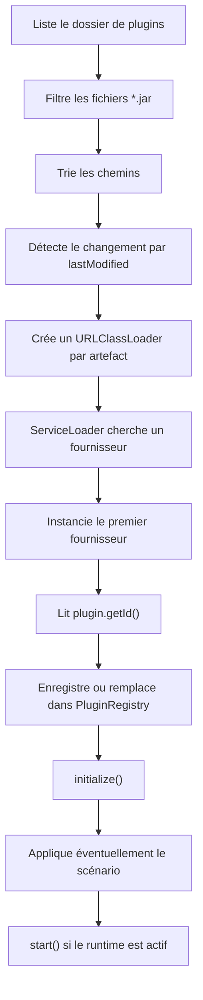
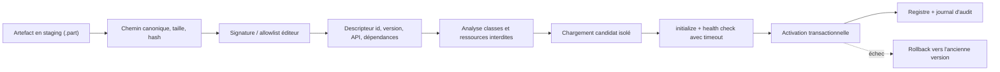

# Audit des risques du chargement de plugins JAR dans SiphoniX

**Projet :** SiphoniX
**Date de l’audit :** 14 septembre 2026
**Objet :** conflits de dépendances, sécurité, robustesse et cycle de vie du mécanisme de plugins.

## 1. Résumé exécutif

Le mécanisme actuel est fonctionnel pour des plugins internes et maîtrisés, mais il ne constitue pas une frontière de sécurité.

Les réponses directes aux questions posées sont les suivantes :

1. **Deux plugins peuvent-ils avoir des dépendances conflictuelles ?** Oui. Le classloader dédié à chaque JAR limite une partie des conflits entre dépendances privées de deux plugins. En revanche, la délégation Java est parent-first : une classe déjà fournie par SiphoniX est prioritaire sur celle embarquée dans le plugin. Des incompatibilités plugin/runtime peuvent donc produire des erreurs telles que `NoSuchMethodError`, `AbstractMethodError`, `LinkageError` ou `ClassCastException`.
2. **Les dépendances de deux plugins sont-elles entièrement isolées ?** Non. Les types échangés, les ressources `META-INF/services`, la journalisation, les propriétés système, les threads, les bibliothèques natives, les pilotes JDBC et les autres registres globaux restent des surfaces de collision.
3. **Lire tous les JAR d’un dossier et les exécuter est-il un problème de sécurité ?** Oui, dès qu’un acteur non fiable peut écrire dans ce dossier ou remplacer un artefact. `ServiceLoader` instancie le fournisseur avant toute validation métier. Son constructeur et ses initialisateurs statiques exécutent alors du code arbitraire avec les droits du processus SiphoniX.
4. **Le `URLClassLoader` protège-t-il SiphoniX d’un plugin malveillant ?** Non. Il organise le chargement des classes ; il ne crée ni sandbox, ni contrôle de permissions, ni isolation mémoire ou réseau.
5. **Niveau de risque actuel :** **critique en production si le répertoire de plugins est modifiable par un acteur non fiable**, et encore plus élevé si le processus peut accéder à `/var/run/docker.sock`.

La règle d’exploitation doit être explicite : dans l’architecture actuelle, **un plugin doit être considéré comme aussi fiable que SiphoniX lui-même**.

## 2. Périmètre audité

L’analyse porte principalement sur :

- `PluginArtifactLoader.java`, création du classloader et instanciation par `ServiceLoader` ;
- `PluginRuntimeLoader.java`, scan du dossier, activation, remplacement et watcher ;
- `PluginRegistry.java`, enregistrement et cycle de vie ;
- `Plugin.java` et `PluginContext.java`, contrats exposés ;
- `siphonix-plugins/adaptiflow-engine-plugin/pom.xml`, production du JAR avec dépendances ;
- les fichiers `docker-compose.yml` des exemples, notamment les montages du dossier de plugins et du socket Docker.

Il s’agit d’un audit statique du code présent dans le dépôt. Aucun test d’intrusion et aucune exécution de JAR malveillant n’ont été réalisés.

## 3. Fonctionnement actuel du chargement

Le flux observé est le suivant :



Éléments de preuve :

- les types essayés sont `ScenarioManagementPlugin`, puis `Plugin` : `PluginRuntimeLoader.java:52-54` ;
- le scan périodique est effectué toutes les deux secondes : `PluginRuntimeLoader.java:56` ;
- tous les fichiers réguliers dont le nom finit par `.jar` sont retenus et triés : `PluginRuntimeLoader.java:386-401` ;
- un classloader est créé pour un seul artefact, avec le classloader SiphoniX comme parent : `PluginArtifactLoader.java:44-49` ;
- l’itération sur `ServiceLoader` instancie le premier fournisseur trouvé : `PluginArtifactLoader.java:51-53` ;
- le plugin est ensuite enregistré, initialisé, éventuellement démarré et configuré : `PluginRuntimeLoader.java:311-355`.

## 4. Ce que l’isolation actuelle protège réellement

### 4.1 Protection existante

Chaque artefact reçoit son propre `URLClassLoader`. Ainsi, si :

- le plugin A embarque une version d’une bibliothèque ;
- le plugin B embarque une autre version ;
- cette bibliothèque n’existe pas dans le classloader parent ;
- les objets de cette bibliothèque ne traversent pas les frontières entre plugins ;

alors les deux versions peuvent généralement coexister. Une classe est identifiée par son nom **et** son classloader, ce qui sépare les classes privées des deux artefacts.

La fermeture du classloader lors d’un déchargement est également une bonne intention pour libérer les fichiers JAR.

### 4.2 Limites de cette protection

Le constructeur de `URLClassLoader` reçoit `getClass().getClassLoader()` comme parent. Le modèle standard est parent-first : avant de charger sa propre copie d’une classe, le plugin demande au parent.

Conséquences :

- une dépendance présente dans SiphoniX peut masquer la version voulue par le plugin ;
- un plugin compilé contre une API plus récente peut charger l’ancienne version du runtime et échouer à l’exécution ;
- deux plugins ne peuvent pas naturellement importer les classes privées l’un de l’autre, car leurs classloaders sont frères ;
- un contrat qui expose des types provenant d’une bibliothèque tierce rend l’isolation fragile ;
- les ressources et fournisseurs SPI peuvent être visibles selon la délégation et se combiner de façon inattendue.

Le classloader dédié est donc une **isolation de noms partielle**, pas une gestion de dépendances complète.

## 5. Analyse des conflits de dépendances

### 5.1 Conflit plugin contre SiphoniX

C’est le scénario le plus probable avec le parent-first.

Exemple :

- SiphoniX embarque `lib-x:1` ;
- le plugin est compilé et assemblé avec `lib-x:2` ;
- une classe du même package existe dans les deux versions ;
- le parent fournit la version 1 ;
- le plugin appelle une méthode disponible uniquement en version 2.

Le chargement peut réussir, puis échouer plus tard avec `NoSuchMethodError`. Ce type de défaut échappe souvent aux tests unitaires du plugin exécutés avec son propre classpath.

### 5.2 Conflit entre deux plugins

Deux dépendances purement internes peuvent coexister grâce aux classloaders séparés. Le conflit réapparaît cependant lorsque :

- un objet d’une dépendance privée passe dans `PluginContext`, un registre statique ou une API partagée ;
- un plugin tente d’utiliser directement une classe d’un autre plugin ;
- les deux installent un fournisseur global, un driver JDBC, un MBean ou un gestionnaire de sécurité ;
- les deux modifient une propriété système ou le context classloader d’un thread ;
- les deux chargent une bibliothèque native portant le même nom ;
- un thread ou un cache statique conserve l’ancien classloader après un reload.

Dans ces cas, l’erreur peut être une incompatibilité de type, une fuite mémoire, un comportement dépendant de l’ordre de chargement ou un échec de rechargement.

### 5.3 JAR « avec dépendances »

Le plugin AdaptiFlow utilise `maven-assembly-plugin` avec `jar-with-dependencies` : `siphonix-plugins/adaptiflow-engine-plugin/pom.xml:60-79`.

Ce packaging décompresse les dépendances dans un JAR unique, sans relocation des packages. Le POM inclut notamment :

- `siphonix-api` ;
- `slf4j-api` ;
- `slf4j-simple` ;
- les bibliothèques AdaptiFlow, collecteurs et actions.

L’artefact inspecté contient effectivement une copie de `Plugin.class`, un fournisseur `slf4j-simple` et plusieurs fichiers `META-INF/services`. Cela augmente les risques de classes dupliquées et de fournisseurs SPI concurrents.

Politique recommandée :

- déclarer `siphonix-api` en portée `provided` ;
- ne jamais embarquer `siphonix-kernel` ou `siphonix-runtime` dans un plugin ;
- garder l’API de journalisation partagée, mais laisser l’implémentation SLF4J au runtime ;
- relocaliser les dépendances privées à risque avec Maven Shade, ou définir un classloader sélectif ;
- interdire les types tiers dans les interfaces échangées entre le runtime et les plugins.

### 5.4 Absence de modèle de dépendances

Le contrat expose `getVersion()`, mais le noyau n’utilise pas cette valeur pour décider de la compatibilité. Il n’existe pas de descripteur déclarant :

- la version minimale/maximale de l’API SiphoniX ;
- les dépendances vers d’autres plugins ;
- les versions requises ;
- la version minimale de Java ;
- les permissions nécessaires ;
- le checksum ou le signataire.

L’ordre de chargement est l’ordre lexical des chemins, et non un tri topologique de dépendances. Un plugin qui dépend d’un autre plugin n’a donc ni résolution, ni garantie d’ordre, ni diagnostic adapté.

### 5.5 Plusieurs fournisseurs dans le même JAR

Le chargeur retourne le premier fournisseur produit par `ServiceLoader`. Les autres sont ignorés. L’ordre dépend du contenu des descripteurs de services et peut devenir ambigu après assemblage.

Un artefact devrait soit contenir exactement un plugin principal, soit disposer d’un descripteur SiphoniX explicite permettant de lister et valider plusieurs fournisseurs.

## 6. Analyse de sécurité

### 6.1 Exécution arbitraire avant validation

La ligne `for (T plugin : loader)` déclenche la découverte et l’instanciation. Avant que SiphoniX ne lise l’identifiant, la version ou l’état, le JAR peut déjà exécuter :

- un initialisateur statique ;
- un constructeur ;
- du code indirect déclenché par une dépendance ou un fournisseur SPI.

Il n’existe actuellement ni allowlist, ni validation cryptographique, ni vérification de signature, ni politique d’éditeur, ni contrôle de compatibilité avant cette étape.

**Conclusion : déposer un JAR de plugin accepté équivaut à obtenir l’exécution de code dans le processus SiphoniX.**

### 6.2 Privilèges disponibles pour un plugin

Un plugin s’exécute dans la même JVM et sous le même utilisateur système que SiphoniX. Il peut donc, selon les permissions du conteneur :

- lire les variables d’environnement, tokens et configurations ;
- lire ou modifier les fichiers accessibles ;
- ouvrir des connexions réseau ;
- lancer des threads ou des processus ;
- appeler `System.exit()` ;
- modifier des propriétés et registres globaux ;
- perturber ou espionner d’autres plugins ;
- consommer toute la mémoire, le CPU ou les descripteurs de fichiers.

Aucun mécanisme dans `URLClassLoader` ne réduit ces droits.

### 6.3 Socket Docker : aggravation critique

Les exemples montent `/var/run/docker.sock` dans le conteneur qui exécute SiphoniX, par exemple :

- `samples/adaptiflow-json-scenarios/docker-compose.yml:29` ;
- `samples/adaptiflow-yaml-scenarios/docker-compose.yml:27` ;
- `samples/adaptable-teastore-image/docker-compose.yml:39`.

Si le processus possède les droits d’accès au socket, un plugin arbitraire peut piloter le daemon Docker : créer un conteneur privilégié, monter le système de fichiers hôte ou extraire des secrets. Le risque n’est alors plus limité au conteneur.

Le socket brut ne devrait pas être accessible à un runtime extensible. Si les actions d’adaptation nécessitent Docker, utiliser un service séparé ou un proxy Docker qui n’autorise qu’un ensemble minimal d’opérations.

### 6.4 Répertoire de plugins modifiable et watcher automatique

Dans les exemples JSON, YAML et XML, le montage est actuellement :

```yaml
- ./plugins:/opt/siphonix/plugins
```

Il n’est pas en lecture seule et le mode par défaut est `watch-auto`. Toute compromission donnant l’écriture sur le dossier hôte permet donc une tentative de chargement automatique en quelques secondes.

Mesures immédiates :

```yaml
- ./plugins:/opt/siphonix/plugins:ro
```

et, en production :

```yaml
SIPHONIX_PLUGIN_DISCOVERY_MODE: "startup-only"
```

Le déploiement d’un nouveau plugin doit devenir une opération contrôlée, vérifiée puis suivie d’un redémarrage, au moins tant que la chaîne de confiance n’est pas implémentée.

### 6.5 JAR partiel, lien symbolique et course de fichiers

Le scan utilise `Files.isRegularFile(path)`, qui suit normalement les liens symboliques, puis lit directement le même chemin. Il ne :

- rejette pas explicitement les symlinks ;
- vérifie pas que le chemin canonique reste dans le dossier autorisé ;
- copie pas l’artefact vers un snapshot immuable ;
- vérifie pas que la taille et le hash restent stables ;
- impose pas de taille maximale.

Le watcher peut donc observer un JAR pendant sa copie, suivre un lien vers un autre emplacement ou charger des octets différents de ceux qui auraient été vérifiés. Les déploiements doivent utiliser un fichier `.part`, puis un renommage atomique après vérification.

### 6.6 Déni de service par simple JAR

Un JAR sans fournisseur valide provoque une exception. Au démarrage, cette exception peut arrêter tout le bootstrap SiphoniX. Un plugin peut également bloquer indéfiniment dans son constructeur, `initialize()`, `start()` ou `stop()`, car aucun timeout de cycle de vie n’est appliqué.

Les erreurs de type `ServiceConfigurationError` et `LinkageError` héritent de `Error`, alors que `PluginArtifactLoader` intercepte seulement `Exception`. Certaines erreurs de chargement peuvent donc contourner le nettoyage prévu.

## 7. Défauts de robustesse et de cycle de vie

### 7.1 Rechargement non transactionnel

`PluginRegistry.replace()` :

1. arrête l’ancien plugin ;
2. le retire du registre ;
3. enregistre et initialise le nouveau ;
4. redémarre le nouveau si l’ancien fonctionnait.

Si l’initialisation ou le démarrage du nouveau échoue, l’ancien n’est pas restauré. Le service reste sans version fonctionnelle.

De plus, `PluginRuntimeLoader.loadAndActivate()` met à jour ses maps avant d’appliquer la configuration du scénario. Si cette configuration échoue, le nouveau classloader est fermé mais le registre ou les maps peuvent encore référencer partiellement le nouveau plugin.

Le remplacement doit être transactionnel, avec rollback testé.

### 7.2 Échec partiel des opérations globales

`initializeAll()`, `startAll()` et `stopAll()` itèrent sans stratégie de compensation. Si le troisième plugin échoue :

- les deux premiers peuvent déjà être démarrés ;
- les suivants ne sont pas traités ;
- l’état global devient partiel.

Chaque transition devrait enregistrer les plugins déjà traités et exécuter une compensation dans l’ordre inverse.

### 7.3 Verrou conservé pendant du code plugin

De nombreuses méthodes de `PluginRuntimeLoader` sont `synchronized` et appellent ensuite le code du plugin pendant que le verrou est détenu. Un plugin lent, bloqué ou réentrant peut immobiliser :

- le watcher ;
- les commandes d’administration ;
- le chargement ou déchargement des autres plugins.

Il faut protéger uniquement les mutations de structures internes et exécuter les callbacks hors verrou, avec timeout.

### 7.4 Registre annoncé « synchronized », mais non synchronisé

La JavaDoc de `PluginRegistry` annonce des opérations synchronisées, mais ses méthodes ne le sont pas. `list()` retourne en outre une vue non modifiable mais vivante de `plugins.values()`, pas un snapshot.

Des lectures et mutations concurrentes peuvent provoquer des résultats incohérents ou `ConcurrentModificationException`. Le registre doit utiliser un verrou cohérent ou publier des snapshots immuables.

### 7.5 Détection uniquement par date de modification

Un artefact est considéré changé uniquement si son nouveau `lastModified` est strictement supérieur à l’ancien : `PluginRuntimeLoader.java:274-290`.

Un remplacement conservant la même date, ou une date antérieure, n’est pas rechargé. À l’inverse, une modification de date sans modification de contenu provoque un reload inutile. Un hash de contenu est plus fiable.

### 7.6 Identifiants dupliqués et mappings ambigus

Le registre exige un identifiant globalement unique, mais deux chemins peuvent fournir successivement le même `pluginId`. Les maps chemin-vers-plugin peuvent alors conserver plusieurs chemins pour le même identifiant. La suppression d’un ancien chemin peut décharger la version active provenant d’un autre chemin.

Un plugin doit avoir un artefact propriétaire unique, validé avant activation.

### 7.7 Fermeture du classloader

Fermer un `URLClassLoader` ne décharge pas automatiquement les classes. Le déchargement réel exige qu’aucune référence, aucun thread et aucun cache ne retienne le classloader.

Par ailleurs, le shutdown actuel ferme les classloaders via `runtimeLoader.close()` avant `pluginRegistry.stopAll()`. Un `stop()` qui tente encore de charger une classe ou une ressource depuis son JAR peut échouer. L’ordre sûr est : arrêter les plugins, vérifier la fin de leurs threads, puis fermer les classloaders.

## 8. Matrice de risques

| ID | Risque | Impact | Probabilité actuelle | Niveau |
|---|---|---|---|---|
| R1 | JAR non authentifié exécuté dans la JVM | compromission complète de SiphoniX | moyenne à élevée selon les droits d’écriture | **Critique** |
| R2 | Plugin avec accès au socket Docker | compromission potentielle de l’hôte | moyenne si le socket est accessible | **Critique** |
| R3 | Conflit de version plugin/runtime parent-first | crash ou comportement incorrect | élevée à mesure que les plugins se multiplient | **Élevé** |
| R4 | Reload sans rollback | interruption de service | moyenne | **Élevé** |
| R5 | Callback plugin sans timeout | blocage du bootstrap/watcher/arrêt | moyenne | **Élevé** |
| R6 | Absence de descripteur de compatibilité/dépendances | activation d’un plugin incompatible | élevée | **Élevé** |
| R7 | Dossier modifiable + `watch-auto` | exécution automatique après dépôt | moyenne | **Élevé** |
| R8 | Registre non thread-safe | état incohérent | moyenne | **Élevé** |
| R9 | Course sur copie, symlink, absence de limite | contournement ou déni de service | faible à moyenne | **Moyen** |
| R10 | Détection par mtime seulement | mise à jour manquée | moyenne | **Moyen** |
| R11 | Plusieurs fournisseurs, premier seulement | mauvais plugin sélectionné | faible à moyenne | **Moyen** |
| R12 | Fuite de classloader/threads après reload | croissance mémoire et instabilité | moyenne | **Élevé** |

## 9. Architecture cible recommandée



### 9.1 Priorité P0 — avant usage production

- rendre le dossier de plugins non inscriptible par le processus et le monter en `:ro` ;
- utiliser `startup-only` en production ;
- retirer l’accès direct au socket Docker du processus extensible, ou le remplacer par un proxy à privilèges minimaux ;
- maintenir une allowlist `nom d’artefact + SHA-256` fournie par une configuration elle-même protégée ;
- refuser les symlinks, les chemins sortant du dossier et les artefacts trop volumineux ;
- vérifier l’artefact avant toute création de `ServiceLoader` ;
- charger uniquement après copie atomique terminée.

### 9.2 Priorité P1 — compatibilité des dépendances

Créer un descripteur, par exemple `META-INF/siphonix-plugin.json`, contenant au minimum :

```json
{
  "id": "adaptiflow-engine",
  "version": "1.0.0",
  "siphonixApi": "[1.0,2.0)",
  "java": ">=11",
  "dependencies": [],
  "sha256": "..."
}
```

Adopter une politique de classloading documentée :

- parent-first obligatoire pour `java.*`, l’API SiphoniX et la façade de logging ;
- dépendances privées chargées par le classloader du plugin ;
- interdiction d’embarquer les modules kernel/runtime ;
- relocation des bibliothèques privées connues pour entrer en conflit ;
- aucune classe tierce dans les contrats publics entre plugins.

### 9.3 Priorité P1 — activation fiable

- préparer et valider le candidat sans modifier le registre actif ;
- borner `initialize`, `start` et `stop` par des timeouts ;
- activer atomiquement le candidat ;
- restaurer l’ancienne instance si l’activation échoue ;
- arrêter le plugin avant de fermer son classloader ;
- remplacer la détection mtime par un hash ;
- ne pas exécuter de callback plugin sous le verrou du loader.

### 9.4 Priorité P2 — traçabilité et maintenance

Journaliser pour chaque opération :

- chemin canonique ;
- SHA-256 ;
- identité/version déclarées ;
- signataire ou source de confiance ;
- version de l’API SiphoniX ;
- résultat des validations ;
- transitions de cycle de vie ;
- motif détaillé du rejet ou du rollback.

Conserver un inventaire et un SBOM par plugin. Ajouter en CI une analyse des vulnérabilités, des classes dupliquées et des dépendances convergentes.

## 10. Choix de confiance

Deux modèles sont possibles.

### Modèle A — plugins internes de confiance

Le chargement en JVM reste acceptable si :

- tous les plugins sont produits et signés par l’organisation ;
- le pipeline et le dossier d’artefacts sont protégés ;
- les checksums sont vérifiés ;
- les dépendances respectent une politique stricte ;
- le rechargement est transactionnel.

C’est le chemin d’évolution le plus court pour SiphoniX.

### Modèle B — plugins tiers ou non fiables

Un classloader ne suffit pas. Les plugins doivent s’exécuter dans un processus ou conteneur séparé, avec :

- utilisateur et système de fichiers dédiés ;
- réseau limité ;
- quotas CPU/mémoire ;
- aucun socket Docker brut ;
- protocole RPC réduit et authentifié ;
- arrêt forcé possible ;
- secrets minimaux.

C’est la seule option robuste si le code du plugin ne peut pas être considéré comme pleinement fiable.

## 11. Tests à ajouter

### Dépendances

- deux plugins embarquant deux versions incompatibles de la même bibliothèque privée ;
- un plugin compilé contre une version différente d’une bibliothèque déjà présente dans le runtime ;
- vérification qu’un type privé ne traverse pas l’API ;
- détection de copies de `siphonix-api`, du kernel et de plusieurs bindings SLF4J ;
- ordre déterministe ou rejet explicite de plusieurs fournisseurs.

### Sécurité

- rejet d’un JAR absent de l’allowlist ;
- rejet d’un checksum ou d’une signature invalide ;
- rejet d’un symlink et d’un chemin extérieur au dossier ;
- rejet d’un JAR partiel ou trop volumineux ;
- preuve en test isolé qu’aucun constructeur n’est exécuté avant validation ;
- vérification des permissions du dossier et des montages Docker en CI.

### Cycle de vie

- rollback si `initialize()`, `start()` ou l’application du scénario échoue ;
- timeout d’un plugin bloquant ;
- démarrage global partiel puis compensation ;
- remplacement de deux artefacts portant le même identifiant ;
- absence de thread résiduel et possibilité de libération du classloader après unload ;
- accès concurrent au registre et au watcher.

## 12. Critères de sortie avant production

Le chargement dynamique peut être considéré maîtrisé lorsque :

1. aucun artefact non approuvé ne peut atteindre `ServiceLoader` ;
2. le répertoire est immuable pour le runtime ;
3. le socket Docker brut n’est pas accessible au code plugin ;
4. l’API et les versions compatibles sont vérifiées avant instanciation ;
5. les dépendances partagées et privées suivent une politique testée ;
6. un reload échoué restaure automatiquement l’ancienne version ;
7. les callbacks sont bornés et exécutés hors verrou global ;
8. chaque chargement est auditable par hash, version et provenance ;
9. les tests de conflits, de rejet et de rollback sont automatisés.

## 13. Conclusion

Le mécanisme actuel est adapté à un prototype où tous les plugins sont internes, mais il ne faut pas présenter le classloader par artefact comme une isolation de sécurité ou une résolution complète des dépendances.

Le risque principal n’est pas seulement qu’un plugin « entre en conflit » avec un autre. Le risque principal est qu’un fichier JAR accepté devient immédiatement du code de confiance dans la JVM, avec les mêmes accès que SiphoniX. Dans la topologie d’exemple incluant le socket Docker, cela peut donner un impact sur l’hôte.

L’ordre de priorité recommandé est donc :

1. sécuriser la provenance, le dossier et les privilèges ;
2. formaliser la compatibilité et la politique de dépendances ;
3. rendre l’activation/reload transactionnels ;
4. isoler hors processus tout plugin qui n’est pas pleinement fiable.
